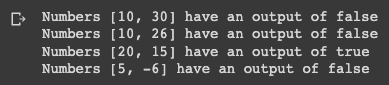

# Quiz 002: Given 2 numbers, A and B, Output TRUE if one of them is 20 or if their sum is 20.

I misunderstood the quiz a little bit and what I did is significantly harder but it was fun. I was supposed to compare nth element from list one with nth element of list two but I compared first element of a list with the second and so forth.

Link to the code: (remember to scroll)

Here are the results of the test cases. [10,30,10,26, 20,15,5,-6]

