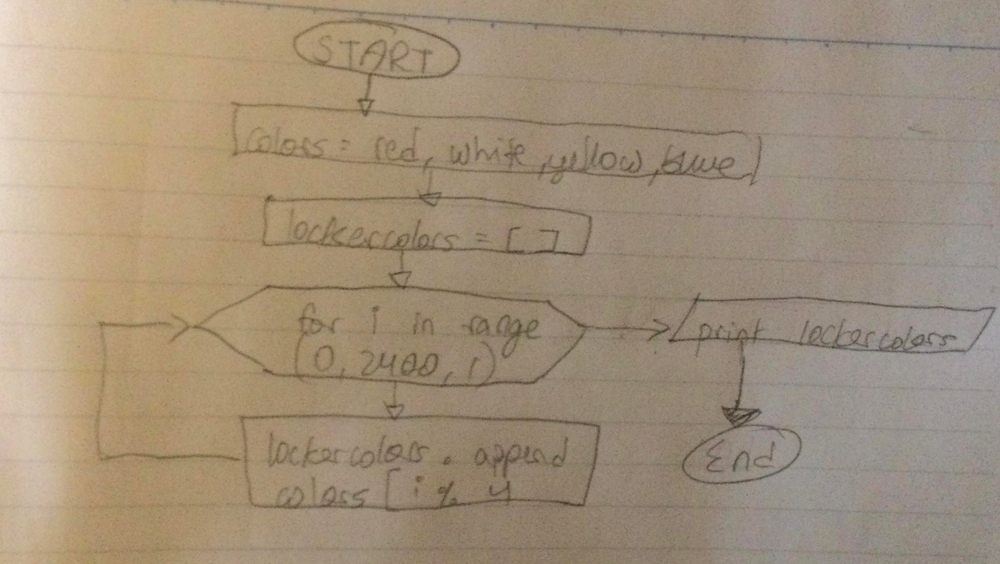
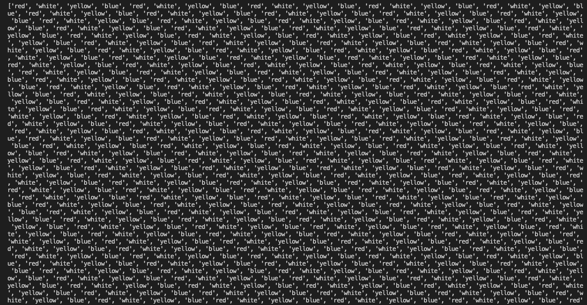
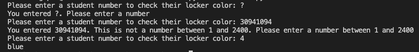
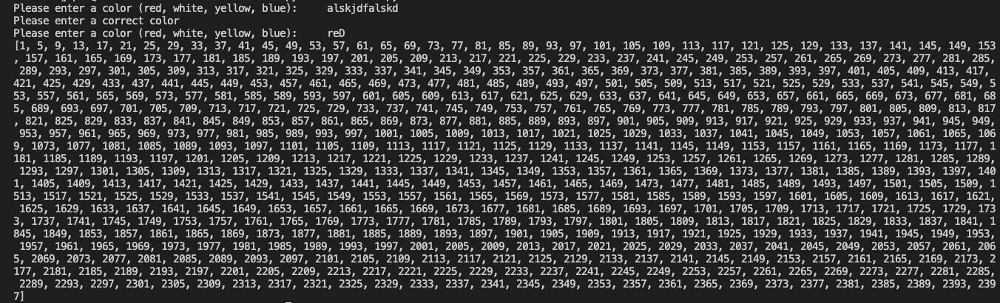
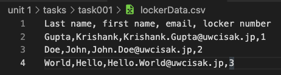

# Task 1

Save your program in a file called task1.md. In a school there are 2400 students and each student uses one locker. Each locker has a unique number from 1 to 2400. The lockers are to be painted in four colors: red, white, yellow and blue, in order of locker numbers, as shown in the following table.link

| Locker Number |  1  |   2   |   3  |    4   |  5  | ... | 2400 |
|:-------------:|:---:|:-----:|:----:|:------:|:---:|:---:|:----:|
|     Color     | red | white | blue | yellow | red | ... | blue |

The pattern of colors continues in this manner. For example, locker number 15 will be painted yellow.

# Task 1: Create a program and the flow diagram that shows the colors of all the lockers from 1 to 2400

### Flowchart

### Code (remember to scroll)

https://github.com/krishank-gupta/ib_com_sci/blob/78732f9961003d32f2a08057664f17b4f509e3eb/unit%201/tasks/task001/subtask1.py#L1-L9

### Results 

Task 2: Using the program above, create another program that allows the user to enter a number and the program outputs the color that should be used in the locker.

### Code (remember to scroll)

https://github.com/krishank-gupta/ib_com_sci/blob/78732f9961003d32f2a08057664f17b4f509e3eb/unit%201/tasks/task001/subtask2.py#L1:L18

### Results

[HL] Task 3: Create a program that receives a color from the user, validates the input,  and outputs the numbers of the lockers of the color provided. Use at least 10 different functions for Manipulating Strings (Learning Log Item 19)

### Code (remember to scroll)

https://github.com/krishank-gupta/ib_com_sci/blob/78732f9961003d32f2a08057664f17b4f509e3eb/unit%201/tasks/task001/subtask3.py#L1-L19

### Results

[HL] Task 4: Given a list of names of students in the format lastname, firstname, create a program that assigns an email address and a locker to each student and saves the results in a file in the format lastname, firstname, email, locker 

### Code (remember to scroll)

https://github.com/krishank-gupta/ib_com_sci/blob/78732f9961003d32f2a08057664f17b4f509e3eb/unit%201/tasks/task001/subtask4.py#L1-18

### Results
