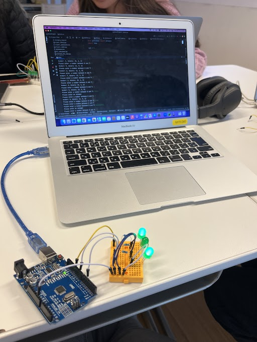

# Binary LEDs Arduino Part 2

In this lesson, we were required to create an arduino circuit with 3 LEDs. We had to ask user for an input and turn on the LEDs in the arduino according to the binary form of the input number.

### Code:

### Circuit:

### Video:

https://user-images.githubusercontent.com/50672613/202328895-cce96cf1-ebb0-47f2-8e66-3899d22f2ac5.mp4

