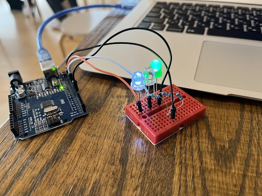

# Binary LEDs Arduino

In this lesson, we were required to create an arduino circuit with 3 LEDs. We had to program is so that the LEDs displayed 3bit binary numbers.

### Code:

https://github.com/krishank-gupta/ib_com_sci/blob/e04086c21095d674982a5c210de1b73d893668fc/unit%202/Lessons/nov8/binary-converter.py#L1-L37

### Circuit:

### Video:

https://user-images.githubusercontent.com/50672613/202328895-cce96cf1-ebb0-47f2-8e66-3899d22f2ac5.mp4

