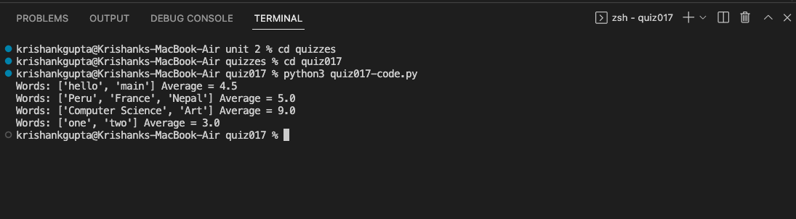

# quiz 017: Create a function that produces the average world length of the input list. [HL] Do not count the spaces

This quiz was super simple. I tried using trim() instead of replace() because I forgot that trim() doesn't remove empty space in between words. 

Link to the code: (remember to scroll)

Here are the results for the test cases.

