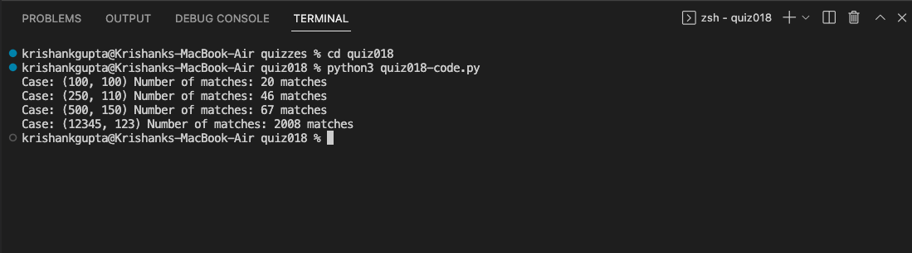

# Quiz 18: Help Lily

Lily was crossing a forest when she realizes that there is a tiger ahead of her who has seen Lily. 
Lily quickly takes out a matchbox from her bag and burns a matchstick, because the tiger is afraid of fire . 

A matchstick takes 5 seconds to burn completely.
The length of the forest that Lily needs to cross is l meters
Lily's speed is s cm/s

what is the minimum number of matchsticks Lily needs to burn to cross the forest safely.

# Link to the code: (remember to scroll)

https://github.com/krishank-gupta/ib_com_sci/blob/ed2099ec22566dba716b3e9c85e1a622a76d39fd/unit%202/quizzes/quiz018/quiz018-code.py#L1-L21

# Results

