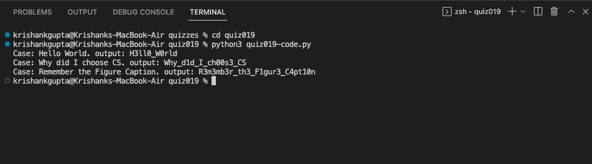

# Quiz 019: Create a function that changes the vowels in a string to numbers such as a=4,e=3,i=1,o=0 and space by _. [HL] Libraries or methods not allowed for this quiz. You can use dictionaries. Create a Boolean circuit for: AB + not(B+C) + B(notC notA)

Since we were not allowed to use the replace method, I created a dictionary with all the key value pairs. I then used a loop for each character and checked to see if character is a key in the dictionary. If it is then change that position to the value of that key. If not then no changes.

# Boolean Circuit

AB + not(B+C) + B(notC notA)

# Code: (remember to scroll)

# Results

