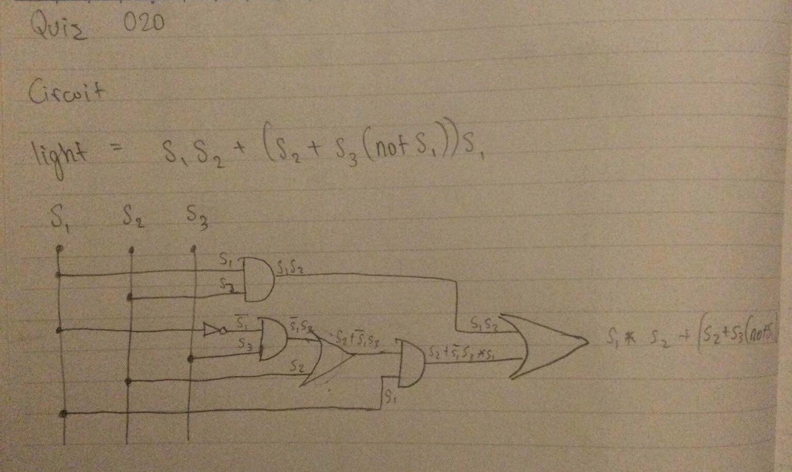

# Quiz 020: Create a function that produces the table of Truth for 3 inputs

This quiz stumped me for a while. Then I figured out the patterns and how to get them. Using the mod function to get the 2^0 position and then using that to create the 2^1 position was fascinating.

# Code: (remember to scroll)

https://github.com/krishank-gupta/ib_com_sci/blob/49de1fbcdb4bcba6ceed65769e021744e8f8d2de/unit%202/quizzes/quiz020/quiz020-code.py#L1-L20

# Results

# Truth table and circuit for: Light = S1S2+(S2+S3(notS1))S1 

### Truth Table

| S1 | S2 | S3 |   | S1 and S2 | not S1 | S3 and (not S1) | S3 and (not S1) | (S3 and (not S1)) or S2 | ((S3 and (not S1)) or S2) and S1 | (S1 and S2) and (((S3 and (not S1)) or S2) and S1) |
|:--:|:--:|:--:|:-:|:---------:|:------:|:---------------:|:---------------:|:-----------------------:|:--------------------------------:|:--------------------------------------------------:|
|  0 |  0 |  0 |   |     0     |    0   |        0        |        0        |            0            |                 0                |                          0                         |
|  0 |  0 |  1 |   |     0     |    0   |        0        |        0        |            0            |                 0                |                          0                         |
|  0 |  1 |  0 |   |     0     |    0   |        0        |        0        |            0            |                 0                |                          0                         |
|  0 |  1 |  1 |   |     0     |    0   |        0        |        0        |            0            |                 0                |                          0                         |
|  1 |  0 |  0 |   |     0     |    0   |        0        |        0        |            0            |                 0                |                          0                         |
|  1 |  0 |  1 |   |     0     |    0   |        0        |        0        |            0            |                 0                |                          0                         |
|  1 |  1 |  0 |   |     0     |    0   |        0        |        0        |            0            |                 0                |                          0                         |
|  1 |  1 |  1 |   |     0     |    0   |        0        |        0        |            0            |                 0                |                          0                         |

### Circuit

