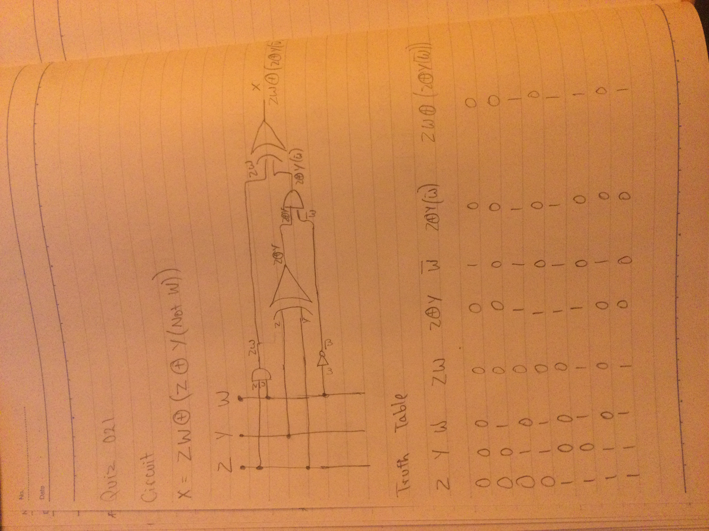

# Quiz 021:

This quiz was quite simple. I took the code from quiz 20 and added a column with the new column. I was confused for a long time because the answers on the quiz description was wrong.

# Code: (remember to scroll)

https://github.com/krishank-gupta/ib_com_sci/blob/97b000adbca4756a294bb20c49120ae43b00b0ea/unit%202/quizzes/quiz021/quiz021-code.py#L1-L45
# Results

# Boolean Circuit and Truth Table

