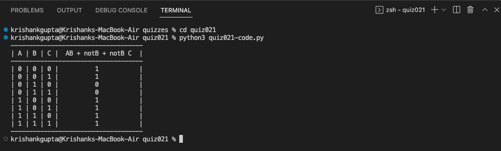

# Quiz 021:

This quiz was quite simple. I took the code from quiz 20 and added a column with the new column. I was confused for a long time because the answers on the quiz description was wrong.

# Code: (remember to scroll)

https://github.com/krishank-gupta/ib_com_sci/blob/93f49729b359dc24bf55bab8a59678cfb64c0788/unit%202/quizzes/quiz021/quiz021-code.py#L1-L22

# Results

# Boolean Circuit and Truth Table

