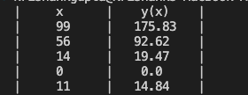

# Quiz 022:

# Proof

A (A+B) = A

# Code: (remember to scroll)

https://github.com/krishank-gupta/ib_com_sci/blob/834ecd975f425d24ae39daaa66d39203255c8cbf/unit%202/quizzes/quiz022/quiz022-code.py#L1-L17

# Results

