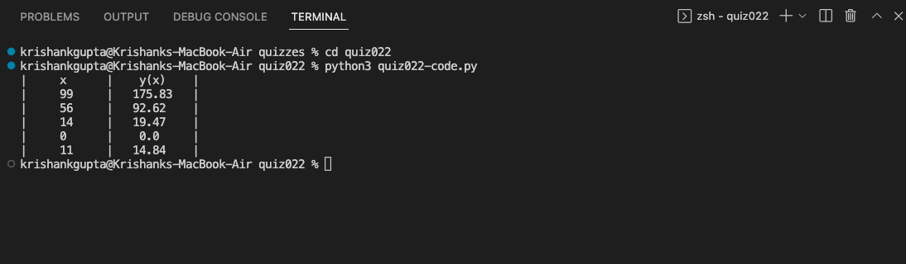

# Quiz 022:

# Proof

A (A+B) = A

| A | B | A+B | A (A+B) |
|:-:|:-:|:---:|:-------:|
| 0 | 0 |  0  |    0    |
| 0 | 1 |  1  |    0    |
| 1 | 0 |  1  |    1    |
| 1 | 1 |  1  |    1    |

A (A+B) is the same as A. Therefore, A and (A or B) = A proven.

# Code: (remember to scroll)

https://github.com/krishank-gupta/ib_com_sci/blob/834ecd975f425d24ae39daaa66d39203255c8cbf/unit%202/quizzes/quiz022/quiz022-code.py#L1-L17

# Results

