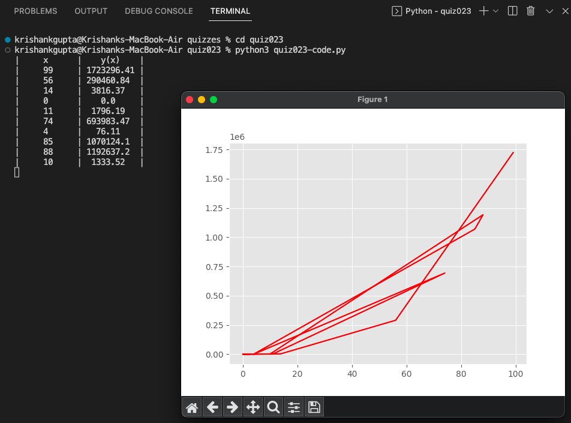
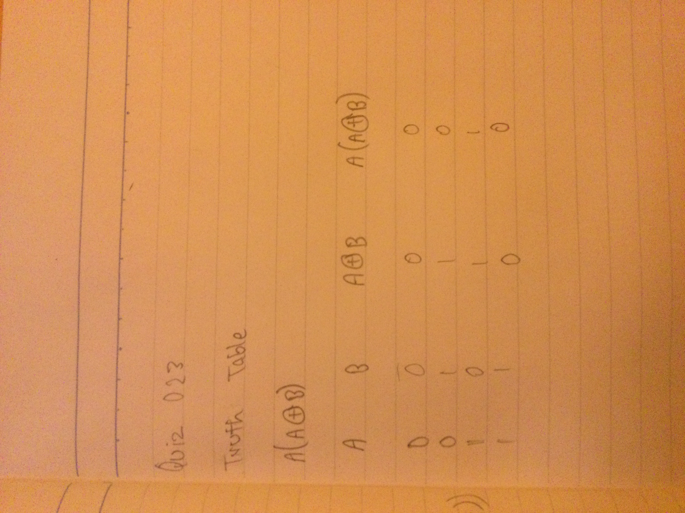

# Quiz 023: Create a program that produces the graph for the function in Quiz #22. $(y = {x^{{-1 \over 2} * ({m \over s})^2}})$

In this quiz, we had to graph the results of Quiz 22. I did this using the matplotlib library that makes it very easy to graph equations. 

# Code: (remember to scroll)

https://github.com/krishank-gupta/ib_com_sci/blob/7b2efcadb2df5c44a9426b8887233715a09aaf88/unit%202/quizzes/quiz023/quiz023-code.py#L1-L35

# Results

# Boolean Circuit and Truth Table

