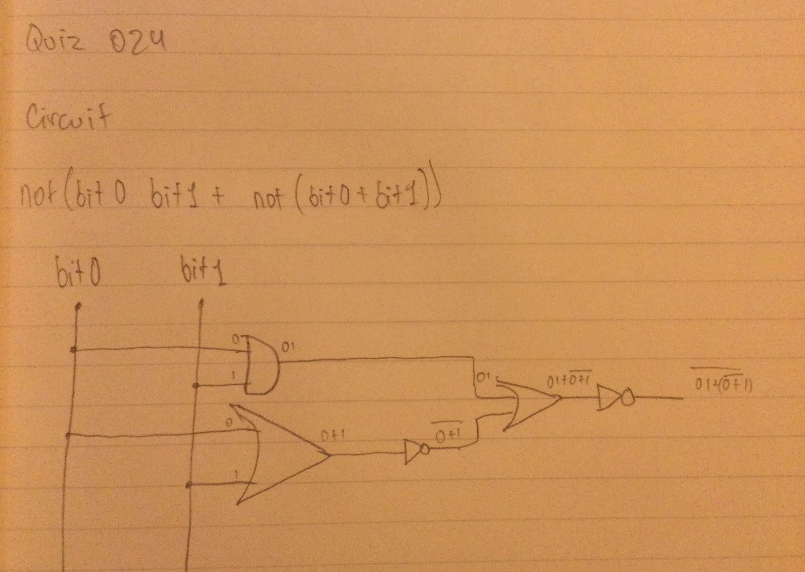

# Quiz 024: Create a program shows the graph of the parabola for 100 values of x in the interval -10 < x < 10. $(y = 2 * {(x + 5)}^2 )$

This quiz was similar to the last one but with the equation changed. I struggled a bit because I forgot that exponents are done using '**'. I kept trying '^' and kept getting the wrong answer but couldn't figure out what was going wrong for a solid 2-3 minutes.

# Code: (remember to scroll)

https://github.com/krishank-gupta/ib_com_sci/blob/97b000adbca4756a294bb20c49120ae43b00b0ea/unit%202/quizzes/quiz024/quiz024-code.py#L1-L23

# Results

# Boolean Circuit and Truth Table

