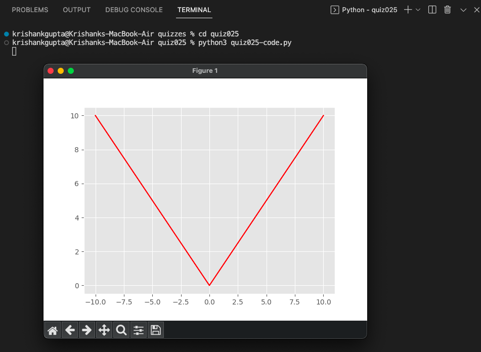

# Quiz 025: Create a program shows the graph of the function below for 100 values of x in the interval -10 < x < 10.    

In this quiz, we had to graph the function of y = abs(x) in the interval -10 < x < 10. It was quite simple and took me about a minute.

# Code: (remember to scroll)

https://github.com/krishank-gupta/ib_com_sci/blob/97b000adbca4756a294bb20c49120ae43b00b0ea/unit%202/quizzes/quiz025/quiz025-code.py#L1-L20
# Results

# Conversion

