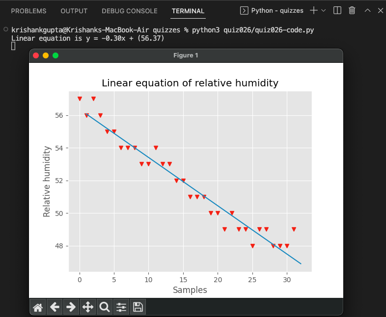

# Quiz 026: 

In quiz 26, we did some more graphing using matplotlib. We learnt how to create models that fit our graph. The models were both linear and non-linear.

# Code: (remember to scroll)

https://github.com/krishank-gupta/ib_com_sci/blob/fceb0f1490ca070853bcb4dcddf22d08e253b952/unit%202/quizzes/quiz026/quiz026-code.py#L1-L41

# Results

# Conversion

