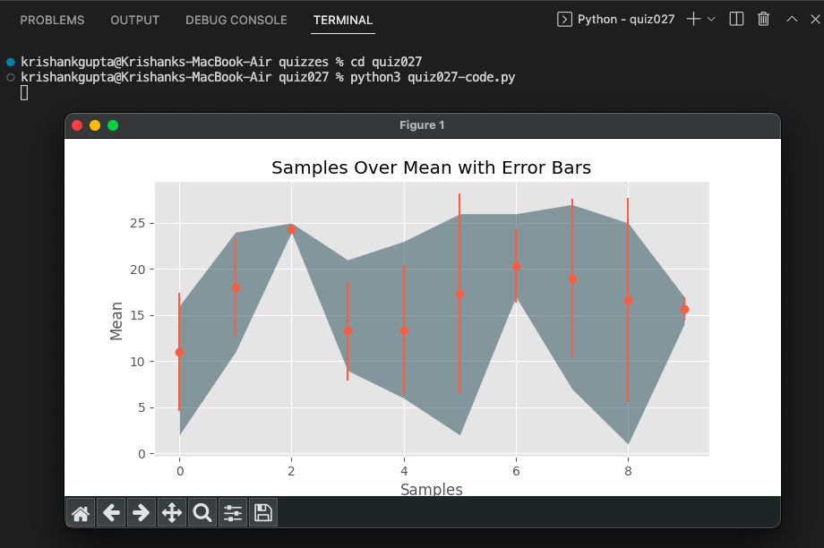

# Quiz 027: 

In this quiz, we had to graph the error bars of the data that was provided. I finished this task in a 2-3 minutes so Dr. Ruben asked me to graph the fill between min and max as well. 

# Code: (remember to scroll)

https://github.com/krishank-gupta/ib_com_sci/blob/fceb0f1490ca070853bcb4dcddf22d08e253b952/unit%202/quizzes/quiz027/quiz027-code.py#L1-L49

# Results

# Conversion

