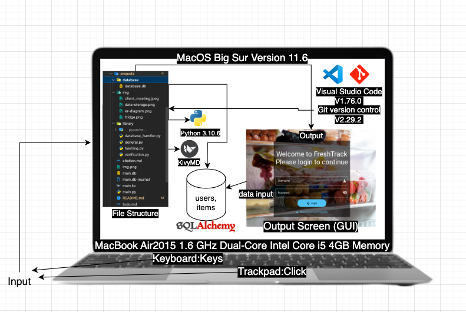
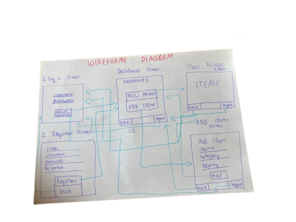

# Unit 3: Fridge Tracker Software

# Table of contents

1. [Criteria A: Planning](#planning)
2. [Criteria B: Solution Overview](#solution)
3. [Criteria C: Development](#development)
4. [Criteria D: Functionality and Extensibility](#functionality)

# <a name="planning"></a> Criteria A: Planning

## Problem definition

$\qquad$ My client is a Residential Assistant (RA) of a house in a boarding International Baccalaureate (IB) school. As an RA of the house, she is responsible to solve any problems that comes up in the house. She wants an application to solve a running problem that has bothered her and her house members for the past year. The problem is with the fridge of the house. The fridge is always messy and filled with expired products. Because of the amount of expired products in the fridge, the fridge smells extremely bad and creates a negative house environment and is also a health hazard. A few days ago someone ate expired fish and got very sick. Additionally, the house members also have a hard time remembering which food is theirs and end up eating other people's food. This pisses the actual food owners off and creates a lot of fights in the house. My client wants to put an end to all by having a fridge tracker app. 

$\qquad$ The fridge tracker app would allow my client and her housemates to add items they own and add information like expiry_date and quantity. The application would also let my client and her housemates to view all items and who own them. This would solve the problem of people eating other people's food. The application would also send warning messages to logged in users when their items are going to expire in the next 7 days or when quantity is low. This will let them be aware of the expiry date and deal with the food item in a timely and proper manner. This will solve the bad smelling and health hazard issues. 

## Proposed Solution and rationale

$\qquad$ Considering the client's requirements, an adequate solution will be creating a Graphic User Interface (GUI) using Python 3.9, KivyMD Library, and SQLlite. 

$\qquad$ For GUIs the choices are a website, a desktop application or a mobile application. A website is not the ideal choice as it is internet dependent and the client may not have internet at all times. A mobile application is also not ideal as the tracker app is not used as often as most mobile apps and would just take space for no reason. 

$\qquad$ The best programming language for desktop applications is Python. Python is easy and has rich libraries to do anything you can think of. This availability of libraries will help me save a lot of time on making the GUI and focus more on the core app functionality. Additionally, python has a huge community and problems that may come up can be solved easily. Some alternatives could be C++ or Java but these are old, outdated, hard-to-understand, and time consuming. Therefore, python is the best choice.

$\qquad$ The easiest way to create a desktop application that will let me create functionality like login system, database connection, etc, is using the KivyMD Library. An alternative would be using the Kivy core library. Kivy is a cross-platform framework for building multi-touch applications that can run on desktop, mobile, and other platforms where as KivyMD library is Google's Material Design implementation of Kivy. Kivy is a general purpose GUI framework where as KivyMD is more specialised and will allow me to create beautiful GUI following design principles very easily and fast. Therefore, using KivyMD is the best choice.

$\qquad$ When it comes to Databases, there are various options like SQL, PostgreSQL, MongoDB, SQLite. SQL, PostgreSQL, and MongoDB are best for enterprise level applications with large amounts of data. For my client's needs, a lightweight, fast, and file-based database system is required. The best option for such requirements is SQLite.

## Success Criteria
1. The application has a login system where users can login and register using username, email, and password 
2. The application provides a screen to let logged in user view, edit, and delete items in the fridge
3. The application gives notifications when an item is about to expire in the next 7 days and changes the color of such items on the table to red
4. The application fridge view has filters that can let you categorize the items based on type of item: meat, sweets, drinks, fruits & veggies, dairy
5. The application fridge view has filters that can let you categorize items based on owner
6. The application gives notifications when an item's quantity is less than 10% of normal and changes the color of such items on the table to orange
7. The application automatically adds the logged in user as owner when adding a new item to the fridge

## Meeting with client to discuss Success Criteria


**Fig.1.1** shows me and my client having a meeting to discuss the initial success criteria that I presented. The client gave some valuable feedback on the scucess criteria and how to make the application more suited to her needs.


# <a name="solution"></a> Criteria B: Solution Overview

## System Diagram


**Fig.2.1** shows the system diagram of the application. It includes the inputs: keyboard and trackpad, the different systems that are used in the application like the programming languages and it's version, Integrated Development Environment (IDE), computer used with it's processor, memory, etc, and also includes the application output screen and the database.


## Entity Relationship Diagram


**Fig.2.2** shows the relationship between the different tables in the database along with each table's data attributes and their primary key.

## UML  Diagram


**Fig.2.3** shows the relationship between the different tables in the database along with each table's data attributes and their primary key.

## WireFrame Diagram


**Fig.2.4** shows the relationship between the different screens in kivymd.

## Flowcharts 


**Fig.2.4** shows the relationship between the different tables in the database along with each table's data attributes and their primary key.

## Data Storage


**Fig.2.x** is a representation of how data is stored in the databse i.e. in tables. The figure shows the representation of one table used in the application called users. The table contains unsafe passwords and dummy accounts as it is only a representation. The actual application uses SHA-256 Hashing to protect passwords. 


## Test Plan
| **Task No.** |  **Planned Action** |          **Planned Outcome**         | **Time Estimate** | **Target Completion Date** | **Criterion** |
|:------------:|:-------------------:|:------------------------------------:|:-----------------:|:--------------------------:|:-------------:|
|       1      | Meeting with client | Start collecting context for problem |       6 min       |        7th Feb 2023        |       A       |
|       2      | Create problem defination | Have the client's problem defined |       25 min       |        9th Feb 2023        |       A       |
|       3      | Create success criterias | Have the success criteria of the application that solved the client's problems |       1 hours       |        15th Feb 2023        |       A       |
|       4      | Present success criteria to client | Have the success criteria of the application aprooved by the client |       10 minutes       |        28th Feb 2023        |       A       |
|       5      | Write rationale | Have the tools used in the application explained and justified |       30 minutes       |        28th Feb 2023        |       A       |
|       n      | Work on Fridge Items Display system | Have the fridge screen display all items and make it deletable and editable  |       30 minutes       |        28th Feb 2023        |       X       |

## Record of Tasks

| **Task No** |                 **Planned Action**                 |                                        **Planned Outcome**                                       | **Time Estimate** | **Target Completion Date** | **Criterion** |
|:-----------:|:--------------------------------------------------:|:------------------------------------------------------------------------------------------------:|:-----------------:|:--------------------------:|:-------------:|
|      1      |                 Meeting with client                |                               Start collecting context for problem                               |       6 min       |        7th Feb 2023        |       A       |
|      2      |              Create problem defination             |                                 Have the client's problem defined                                |       25 min      |        9th Feb 2023        |       A       |
|      3      |              Create success criterias              |          Have the success criteria of the application that solved the client's problems          |      1 hours      |        15th Feb 2023       |       A       |
|      4      |         Present success criteria to client         |                Have the success criteria of the application approved by the client               |     10 minutes    |        28th Feb 2023       |       A       |
|      5      |        Write rationale and proposed solution       |                  Have the tools used in the application explained and justified                  |     45 minutes    |        18th Feb 2023       |       A       |
|      6      |  Present rationale and proposed solution to client |                         Have the proposed solution approved by the client                        |     10 minutes    |        28th Feb 2023       |       A       |
|      7      |          Create and explain system diagram         |              Design and explain a system diagram to represent the application system             |     25 minutes    |        21st Feb 2023       |       B       |
|      8      |           Create Entity Relation Diagram           |                       Create and explain relations between database tables                       |     20 minutes    |        23rd Feb 2023       |       B       |
|      9      |                 Create UML Diagram                 |                Create and explain the relation between different classes in python               |     40 minutes    |        25th Feb 2023       |       B       |
|      10     |       Start working on login system back-end       |               Have a working login system in place (python and database connection)              |      2 hours      |        25th Feb 2023       |       C       |
|      11     |              Create WireFrame Diagram              |                          Show how the screens change in the application                          |     30 minutes    |        26th Feb 2023       |       B       |
|      12     |                  Create Flowcharts                 |                              Explain how certain blocks of code work                             |     45 minutes    |        28th Feb 2023       |       B       |
|      13     |     Create login and register screens in KivyMD    | Have the Graphic User Interface for Login and Register screens completed and connect to back-end |      2 hours      |        3rd Mar 2023        |       C       |
|      14     |                  Design Test Plan                  |              Design an ellaborate plan for testing the application for possible bugs             |      2 hours      |        5th Mar 2023        |       B       |
|      15     |             Research KivyMD components             |      Find great components that can be used in the application to improve the user interface     |      2 hours      |        5th Mar 2023        |       B       |
|      16     |              Create Dashboard screen               |                 Create the Dashboard screen by refering to the wireframe diagram                 |       1 hour      |        6th Mar 2023        |       C       |
|      17     |          Design a global footer in KivyMD          |             Have a footer on every screen that has the options to go back and log out            |      3 hours      |        4th Mar 2023        |       C       |
|      18     |         Add "active" column to users table         |              Be able to see current user by having an active column in the database              |     20 minutes    |        6th Mar 2023        |       C       |
|      19     |             Work on View Fridge screen             |            Have the fridge screen display all items and make it deletable and editable           |      2 hours      |        6th Mar 2023        |       C       |
|      20     |                  Create snackbars                  |                  Present success and warning notifications to users as snackbars                 |     1.5 hours     |        7th Mar 2023        |       C       |
|      21     |                  Update Test Plan                  |                                                ##                                                |      3 hours      |        7th Mar 2023        |       B       |
|      22     |               Create add item screen               |                                     Have an add item screen                                      |      2 hours      |        8th Mar 2023        |       C       |
|      23     |  Connect add item screen with database table items |                    Have items added on the add item screen add on the database                   |       1 hour      |        8th Mar 2023        |       C       |
|      24     |          Add filters to view fridge screen         |                        Sort items in fridge based on owner, quantity, etc                        |       1 hour      |        8th Mar 2023        |       C       |
|      25     |           Create hover effect for buttons          |                           Make buttons more visible with a hover effect                          |     1.5 hours     |        8th Mar 2023        |       C       |
|      26     |        Create viewable password input fields       |                     Have password input fields viewable by the user on click                     |      2 hours      |        8th Mar 2023        |       C       |
|      27     | Create swipe to delete item for view fridge screen |                                               Code                                               |       1 hour      |        9th Mar 2023        |       C       |
|      28     |             Create video for criteria D            |                              Have a video showcasing the application                             |       1 hour      |        10th Mar 2023       |       D       |
|      29     |               Finish record of tasks               |                                 Have a completed record of tasks                                 |       1 hour      |        10th Mar 2023       |       C       |
|      30     |               Choose the color theme               |              Experiment color themes and hues and find the best fit for a fridge app             |     20 minutes    |        10th Mar 2023       |       C       |
|      31     |                 Complete citations                 |                                         Finish citations                                         |       1 hour      |        10th Mar 2023       |       -       |

# <a name="development"></a> Criteria C: Development

## List of techniques used

1. [Object Oriented Programming](#oop)
    1. Inheritance
    2. Attributes and Methods
2. [KivyMD Library](#kivymd)
    1. Components
    2. Theming
3. [Object Relational Mapping using SQL Alchemy](#orm)
    1. Creating tables
    2. Adding data to tables
    3. Retrieving data from tables
4. [SQLite](#sqlite)
5. [Coding principles](#principles)
    1. Don't Repeat Yourself (DRY) principle
    2. Keep It Simple, Stupid (KISS) principle
6. [Git and Github](#git)

## Development

<a name="oop"></a> Object Oriented Programming (OOP).

The application uses an OOP paradigm. 

1. Inheritance
```py
class main(MDApp):
    def __init__(self, **kwargs):
        super().__init__(**kwargs)
```

```py
class Login(MDScreen):
```
The use of OOP Technique of Inheritance is demonstrated in the code snippets above. The main class inherits from it's parent class MDApp which comes from the KivyMD library. This means that the main class automatically inhabits the same properties and functionalities as it's parent class, in this case, the MDApp class. The Login class inherits from MDScreen which is another class from the KivyMD library. Inheritance helps us reuse code that can be reused among classes in the OOP paradigm.

2. Attributes and Methods

```py
class main(MDApp):
    def __init__(self, **kwargs):
        super().__init__(**kwargs)

    def build(self):
        self.theme_cls.theme_style = "Dark"
        self.theme_cls.primary_palette = "LightBlue"
        self.theme_cls.primary_hue = "300"
        return 
    
    def logout(self):
        database_session.query(users).update({users.active: False})
        self.root.current = "Login"

    def goback(self):
        if self.root.current == "Dashboard":
            self.root.current = "Login"
        else:
            self.root.current = "Dashboard"
```

The above code shows the use of OOP Methods within classes. In the snippet, the main class has 4 methods: __init__, build, logout, and goback. The __init__ and build method are KivyMD methods that let you initialize the class and run the application. Logout and goback methods are created to run a certain block of code. These methods are called from the Kivy file when a certain event is fired. For example, when a user clicks on the logout button anywhere in the application, the logout method is run.

<a name="kivymd"></a>  KivyMD

The application uses KivyMD as it's front-end. KivyMD helps us add beautiful components easily.

```kv
<ViewFridge>
    name: "ViewFridge"        

    MDBoxLayout:
        orientation: 'vertical'
        FitImage:
            source:"img.png"

    MDCard:
        size_hint: None, None
        size: 750, 450
        pos_hint: {"center_x": .5, "center_y": .55}
        md_bg_color: 0/255, 0/255, 0/255,0.6
        
        MDBoxLayout:
            id: fridge
            orientation: "vertical"
            padding: "12dp"
            spacing: "12dp"

            MDBoxLayout:
                size_hint: 1,.3


                MDLabel:
                    text: 'View fridge'
                    font_style: 'H3'
                    font_size: 40
                    halign: 'center'

            MDBoxLayout:
                size_hint: 1,.7

                MDScrollView:
                    MDList:
                        id: md_list
                        padding: 0
                        on_parent: root.populate_list()

    CustomTopAppBar:
        titletext: "View Fridge"
```
The above code snippet illustrates the use of KivyMD library in the application. The code is a snippet from the code for the View Fridge Screen that lets you view/edit/delete items in the fridge. The screen consists of a `MDBoxLayout` that contains a `FitImage` widget that sets a background image. After this, there is a `MDCard` which creates a beautiful card. The card consists of a `MDLabel` that has the text of "View Fridge" and a `MDScrollView` that presents data in the fridge in a scroll view. These content inside the card is organized by the use of `MDBoxLayouts`. At the bottom, there is a `CustomTopAppBar` which is a custom widget that is used as a footer for every screen. 

<a name="orm"></a> Object Relational Mapping using SQL Alchemy

```py
from sqlalchemy.ext.declarative import declarative_base
from sqlalchemy import Integer, Column, String, Boolean, create_engine
from sqlalchemy.orm import sessionmaker
from sqlalchemy import select

Base = declarative_base()

# Database Tables Creation
class users(Base):
    __tablename__ = "users"
    id = Column(Integer, primary_key=True)
    email = Column(String(250), unique=True, nullable=False)
    username = Column(String(250), unique=True, nullable=False)
    password = Column(String(300))
    active = Column(Boolean(), default=False)

    def __repr__(self) -> str:
        return f"""id: {self.id},email: {self.email},username: {self.username},password: {self.password}, active: {self.active}"""
```
The above code shows the usage of Object Relational Mapping using SQL Alchemy. The first 4 lines are the imports necessary to import SQL Alchemy to get it working. The users class is used to create a table called users with the columns id whihc is the primary key, email, username, password, and active which is a boolean for the current user. Below this, there is a __repr__ function which is used to create printable representation of the data stored in the table.

<a name="sqlite"></a> 

SQLite is used in the application as the database. The data entered by the user in the application is processed by SQL Alchemy and then stored in the SQLite database. The data is retrieved when the user trys to view the data and edited when the user wants to edit the data.

<a name="principles"></a> Coding Principles

KISS:

The application is divided into classes for each screen or database table. The classes have methods with specific responsibilities. The code for connecting to database using SQL ALchemy is kept simple and easy to understand. In the following example, the simplicity of connecting and communicating with the database is clear. A query is created using SQL Alchemy and is executed in the database session. The result is stored in a res variable. 

```py
query = select(users.username).where(users.active == True)
res = database_session.execute(query).fetchall()
name = (general.str_clean(res))
``` 

Code that needs to be reused throughout classes are kept in a library folder and imported to the main python file and reused as neccesary: `py from library import verification, general `. Verification has password input verifying functionality that is used multiple times in the application and the general has general functions like cleanup strings (remove special chars), etc. 

<a name="git"></a> Git and Github

# <a name="functionality"></a> Criteria D: Functionality and Extensibility

A 7 min video demonstrating the proposed solution with narration

# Citations

1. 

<!-- OWNER ????????? -->
<!-- Client meeting #2 -->
<!-- add expiry date for products
change color of product if expired
23rd feb -->

<!-- Client meeting #1 -->

<!-- Tracker for fridge
    add items in the frigeq
    edit items in the fridge
    delete items from the fridge

Items should have quanity 
Items type:
    sweet
    veggies
    meat
    drinks -->

<!-- 
record of task

first planning. meeting with client
start collecting context of the problm
6 min 
7 feb
A
 -->