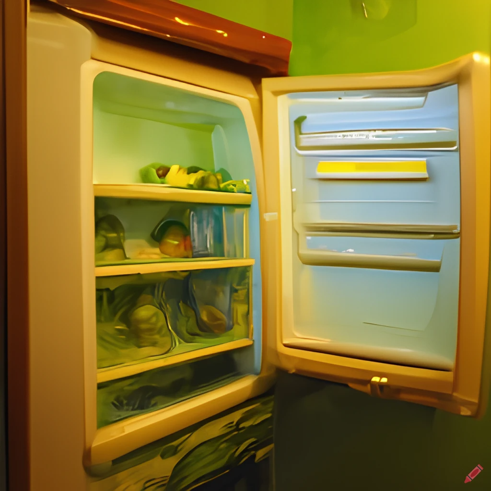
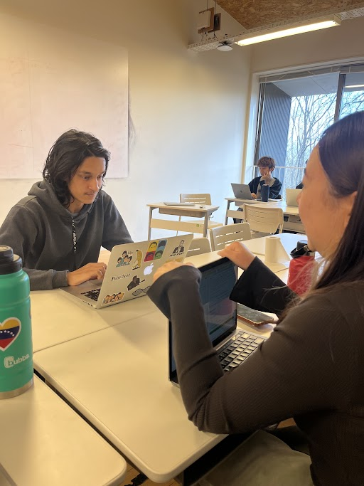
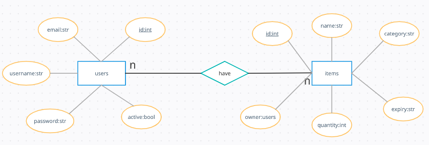
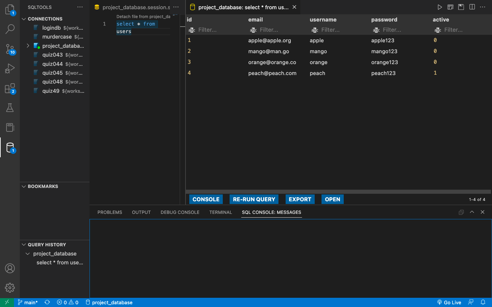

# Unit 3: Fridge Tracker Software

# Criteria A: Planning

## Problem definition

$\qquad$ My client is a Residential Assistant (RA) of a house in a boarding International Baccalaureate (IB) school. As an RA of the house, she is responsible to solve any problems that comes up in the house. She wants an application to solve a running problem that has bothered her and her house members for the past year. The problem is with the fridge of the house. The fridge is always messy and filled with expired products. Because of the amount of expired products in the fridge, the fridge smells extremely bad and creates a negative house environment and is also a health hazard. A few days ago someone ate expired fish and got very sick. Additionally, the house members also have a hard time remembering which food is theirs and end up eating other people's food. This pisses the actual food owners off and creates a lot of fights in the house. My client wants to put an end to all by having a fridge tracker app. 

$\qquad$ The fridge tracker app would allow my client and her housemates to add items they own and add information like expiry_date and quantity. The application would also let my client and her housemates to view all items and who own them. This would solve the problem of people eating other people's food. The application would also send warning messages to logged in users when their items are going to expire in the next 7 days or when quantity is low. This will let them be aware of the expiry date and deal with the food item in a timely and proper manner. This will solve the bad smelling and health hazard issues. 

## Proposed Solution and rationale

$\qquad$ Considering the client's requirements, an adequate solution will be creating a Graphic User Interface (GUI) using Python 3.9, KivyMD Library, and SQLlite. 

$\qquad$ For GUIs the choices are a website, a desktop application or a mobile application. A website is not the ideal choice as it is internet dependent and the client may not have internet at all times. A mobile application is also not ideal as the tracker app is not used as often as most mobile apps and would just take space for no reason. 

$\qquad$ The best programming language for desktop applications is Python. Python is easy and has rich libraries to do anything you can think of. This availability of libraries will help me save a lot of time on making the GUI and focus more on the core app functionality. Additionally, python has a huge community and problems that may come up can be solved easily. Some alternatives could be C++ or Java but these are old, outdated, hard-to-understand, and time consuming. Therefore, python is the best choice.

$\qquad$ The easiest way to create a desktop application that will let me create functionality like login system, database connection, etc, is using the KivyMD Library. An alternative would be using the Kivy core library. Kivy is a cross-platform framework for building multi-touch applications that can run on desktop, mobile, and other platforms where as KivyMD library is Google's Material Design implementation of Kivy. Kivy is a general purpose GUI framework where as KivyMD is more specialised and will allow me to create beautiful GUI following design principles very easily and fast. Therefore, using KivyMD is the best choice.

$\qquad$ When it comes to Databases, there are various options like SQL, PostgreSQL, MongoDB, SQLite. SQL, PostgreSQL, and MongoDB are best for enterprise level applications with large amounts of data. For my client's needs, a lightweight, fast, and file-based database system is required. The best option for such requirements is SQLite.

## Success Criteria
1. The application has a login system where users can login and register using username, email, and password 
2. The application provides a screen to let logged in user view, edit, and delete items in the fridge
3. The application gives notifications when an item is about to expire in the next 7 days and changes the color of such items on the table to red
4. The application fridge view has filters that can let you categorize the items based on type of item: meat, sweets, drinks, fruits & veggies, dairy
5. The application fridge view has filters that can let you categorize items based on owner
6. The application gives notifications when an item's quantity is less than 10% of normal and changes the color of such items on the table to orange
7. The application automatically adds the logged in user as owner when adding a new item to the fridge

## Meeting with client to discuss Success Criteria

**Fig.1.1** shows me and my client having a meeting to discuss the initial success criteria that I presented. The client gave some valuable feedback on the scucess criteria and how to make the application more suited to her needs.

# Criteria B: Solution Overview

## System Diagram
<!--  -->

**Fig.2.1** shows the system diagram of the application. It includes the inputs: keyboard and trackpad, the different systems that are used in the application like the programming languages and it's version, Integrated Development Environment (IDE), computer used with it's processor, memory, etc, and also includes the application output screen and the database.

## Entity Relationship Diagrams

**Fig.2.2** shows the relationship between the different tables in the database along with each table's data attributes and their primary key.

## UML  Diagrams

**Fig.2.3** shows the relationship between the different tables in the database along with each table's data attributes and their primary key.

## Flowcharts 

**Fig.2.4** shows the relationship between the different tables in the database along with each table's data attributes and their primary key.

## Data Storage

**Fig.2.x** is a representation of how data is stored in the databse i.e. in tables. The figure shows the representation of one table used in the application called users. The table contains unsafe passwords and dummy accounts as it is only a representation. The actual application uses SHA-256 Hashing to protect passwords. 

## Test Plan
| **Task No.** |  **Planned Action** |          **Planned Outcome**         | **Time Estimate** | **Target Completion Date** | **Criterion** |
|:------------:|:-------------------:|:------------------------------------:|:-----------------:|:--------------------------:|:-------------:|
|       1      | Meeting with client | Start collecting context for problem |       6 min       |        7th Feb 2023        |       A       |
|       2      | Create problem defination | Have the client's problem defined |       25 min       |        9th Feb 2023        |       A       |
|       3      | Create success criterias | Have the success criteria of the application that solved the client's problems |       1 hours       |        15th Feb 2023        |       A       |
|       4      | Present success criteria to client | Have the success criteria of the application aprooved by the client |       10 minutes       |        28th Feb 2023        |       A       |
|       5      | Write rationale | Have the tools used in the application explained and justified |       30 minutes       |        28th Feb 2023        |       A       |
|       n      | Work on Fridge Items Display system | Have the fridge screen display all items and make it deletable and editable  |       30 minutes       |        28th Feb 2023        |       X       |

## Record of Tasks
| **Task No.** |  **Planned Action** |          **Planned Outcome**         | **Time Estimate** | **Target Completion Date** | **Criterion** |
|:------------:|:-------------------:|:------------------------------------:|:-----------------:|:--------------------------:|:-------------:|
|       1      | Meeting with client | Start collecting context for problem |       6 min       |        7th Feb 2023        |       A       |
|       2      | Create problem defination | Have the client's problem defined |       25 min       |        9th Feb 2023        |       A       |
|       3      | Create success criterias | Have the success criteria of the application that solved the client's problems |       1 hours       |        15th Feb 2023        |       A       |
|       4      | Present success criteria to client | Have the success criteria of the application aprooved by the client |       10 minutes       |        28th Feb 2023        |       A       |
|       5      | Write rationale | Have the tools used in the application explained and justified |       30 minutes       |        28th Feb 2023        |       A       |
|       n      | Work on Fridge Items Display system | Have the fridge screen display all items and make it deletable and editable  |       30 minutes       |        28th Feb 2023        |       X       |

# Criteria C: Development

## List of techniques used

1. [Object Oriented Programming](#oop).
    1. Inheritance
    2. Encapsulation
    3. Attributes and Methods
2. KivyMD Library
    1. Components
    2. Theming
3. Object Relational Mapping using SQL Alchemy
    1. Creating tables
    2. Adding data to tables
    3. Retrieving data from tables
4. SQLite
5. Coding principles
    1. Don't Repeat Yourself (DRY) principle
    2. Keep It Simlpe, Stupid (KISS) principle

## Development

 OOP is used a lot in this application.

# Criteria D: Functionality and Extensibility

A 7 min video demonstrating the proposed solution with narration

# Citations

1. 

<!-- OWNER ????????? -->
<!-- Client meeting #2 -->
<!-- add expiry date for products
change color of product if expired
23rd feb -->

<!-- Client meeting #1 -->

<!-- Tracker for fridge
    add items in the frigeq
    edit items in the fridge
    delete items from the fridge

Items should have quanity 
Items type:
    sweet
    veggies
    meat
    drinks -->

<!-- 
record of task

first planning. meeting with client
start collecting context of the problm
6 min 
7 feb
A
 -->