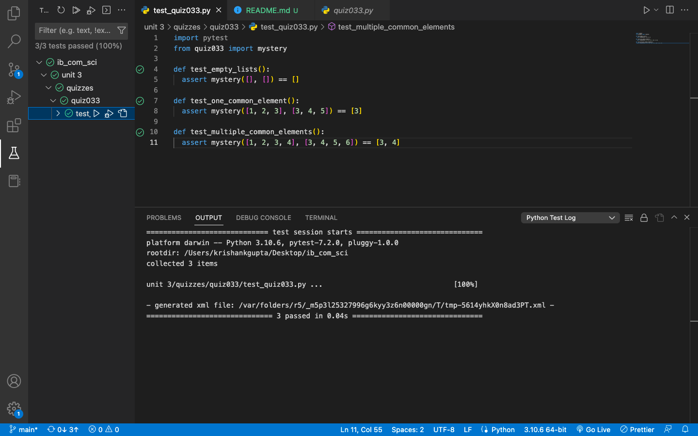

# Quiz 33: Testing 

In this quiz we started with python testing using pytest. Since I use VSCode, it was a bit tricky to set up pytest but I was finally able to do it after researching and reading documentation for hours. It is very satisfying now that I can test my code in one click.

# Link to the code: (remember to scroll)

https://github.com/krishank-gupta/ib_com_sci/blob/de390ad9afab1b4e94495cd323acee211b95eb83/unit%203/quizzes/quiz033/quiz033.py#L1-L10

# Results

 

