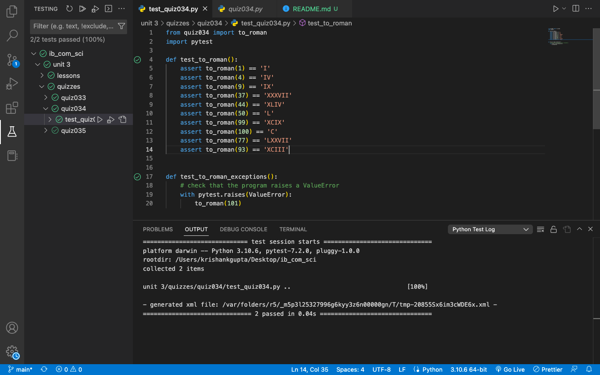

# Quiz 34: Testing 

This quiz was a little tricky at first. I was able to find the main algoright in the given 15 minutes class time but I forgot about a small little thing that made me take longer: loop breaks. 

# Link to the code: (remember to scroll)

https://github.com/krishank-gupta/ib_com_sci/blob/08e7f73f9f1281992ba6efb946027e0526acb92b/unit%203/quizzes/quiz034/quiz034.py#L1-L29

# Results

 

