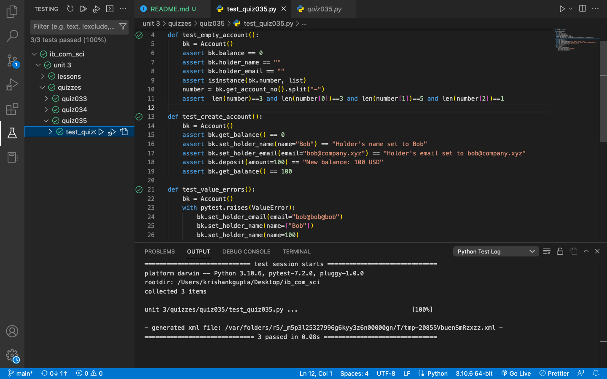

# Quiz 35: OOP from AML Diagram

This quiz was really fun. We had to write an object and all we had was the AML diagram and the testing file. 

# Link to the code: (remember to scroll)

https://github.com/krishank-gupta/ib_com_sci/blob/a74aad11c57f14fa31f4e5b29d14b09b5e416032/unit%203/quizzes/quiz035/quiz035.py#L1-L32

# Results

 

