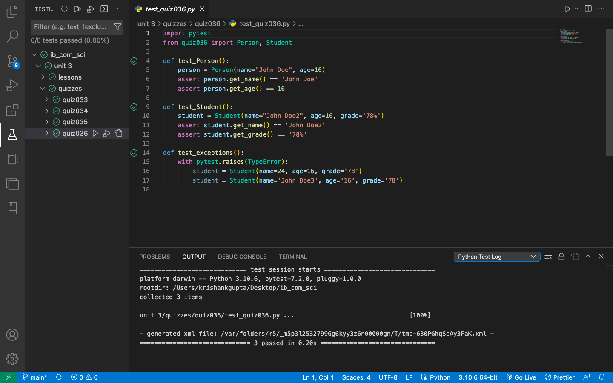

# Quiz 36: 

In this quiz we had to make classes according to the quiz description and also make the test file. 

# Link to the quiz solution: (remember to scroll)

https://github.com/krishank-gupta/ib_com_sci/blob/94ec8edda150b1f4c704703c5523bdc5deb888f6/unit%203/quizzes/quiz036/quiz036.py#L1-L61

# Link to the test file: (remember to scroll)

https://github.com/krishank-gupta/ib_com_sci/blob/94ec8edda150b1f4c704703c5523bdc5deb888f6/unit%203/quizzes/quiz036/test_quiz036.py#L1-L17

# Results

 

