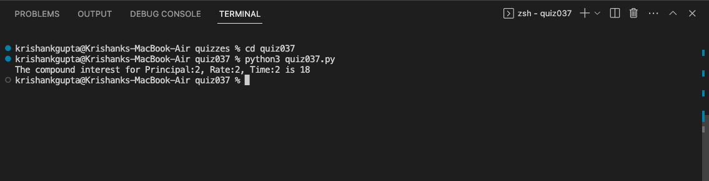

# Quiz 37: 

This quiz used composition to calculate compound interest. 

# Link to the quiz solution: (remember to scroll)

https://github.com/krishank-gupta/ib_com_sci/blob/eab5e16ea0bc847660bcf294eff1ab814077bb9c/unit%203/quizzes/quiz037/quiz037.py#L1-L31

# Results

 

