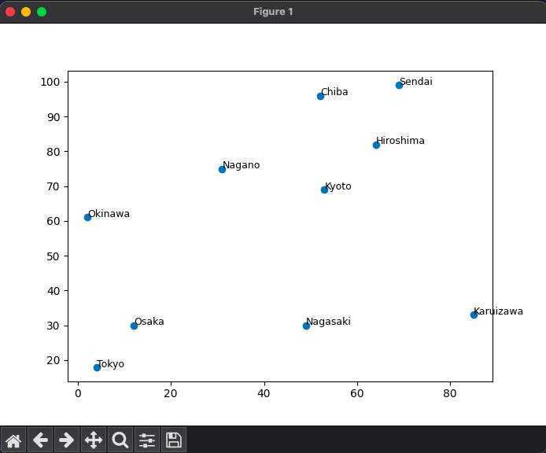

# Quiz 38: 

We had to combine the graphs making skills from unit 2 to OOP and TSP in this quiz. It was not that hard but it was very long.

# Link to the quiz solution: (remember to scroll)

https://github.com/krishank-gupta/ib_com_sci/blob/c08a2d0e097a5993411a1f5a628d91f1fe45c240/unit%203/quizzes/quiz038/quiz038.py#L1-L80

# Results

 

