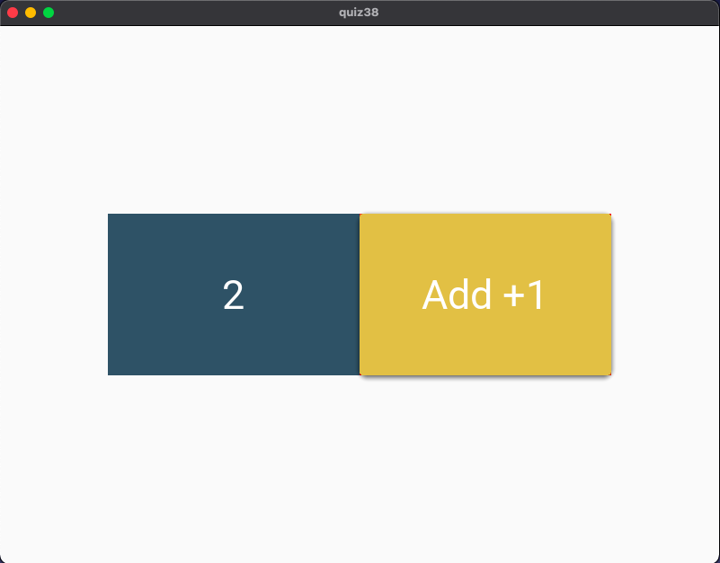

# Quiz 39: 

We started using kivy. In this quiz, we had to make a simple counter gui. I did some research for the color pallete and I am pretty happy with the colors I got.

# Link to the python file: (remember to scroll)

https://github.com/krishank-gupta/ib_com_sci/blob/6c1ffc7c1d77a25fe754034db0969e15c65e9139/unit%203/quizzes/quiz039/quiz038.py#L1-L16

# Link to the kivy file: (remember to scroll)

https://github.com/krishank-gupta/ib_com_sci/blob/6c1ffc7c1d77a25fe754034db0969e15c65e9139/unit%203/quizzes/quiz039/quiz38.kv#L1-L26

# Results

 

