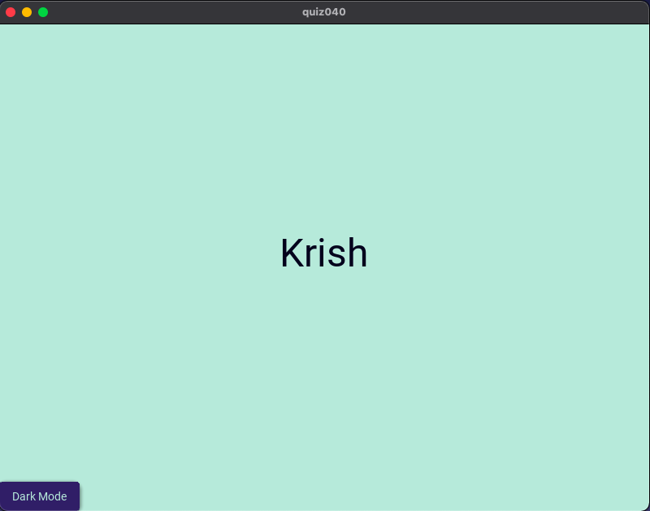
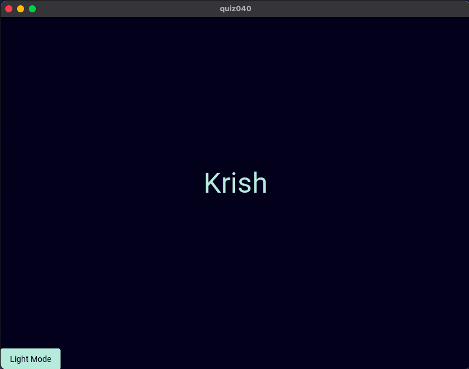

# Quiz 40: 

In this quiz we had to make a simple GUI with a button to change theme. I researched some nice dark and light theme color palletes and I am pretty proud of the result. This quiz also helped me with learning positioning in KivyMD better.

# Link to the python file: (remember to scroll)

https://github.com/krishank-gupta/ib_com_sci/blob/399e329e92e6984ff7fd10958c87afa7eb4073a8/unit%203/quizzes/quiz040/main.py#L1-L35

# Link to the kivy file: (remember to scroll)

https://github.com/krishank-gupta/ib_com_sci/blob/399e329e92e6984ff7fd10958c87afa7eb4073a8/unit%203/quizzes/quiz040/quiz040.kv#L1-L22

# Results Light mode

# Results Dark mode

 

