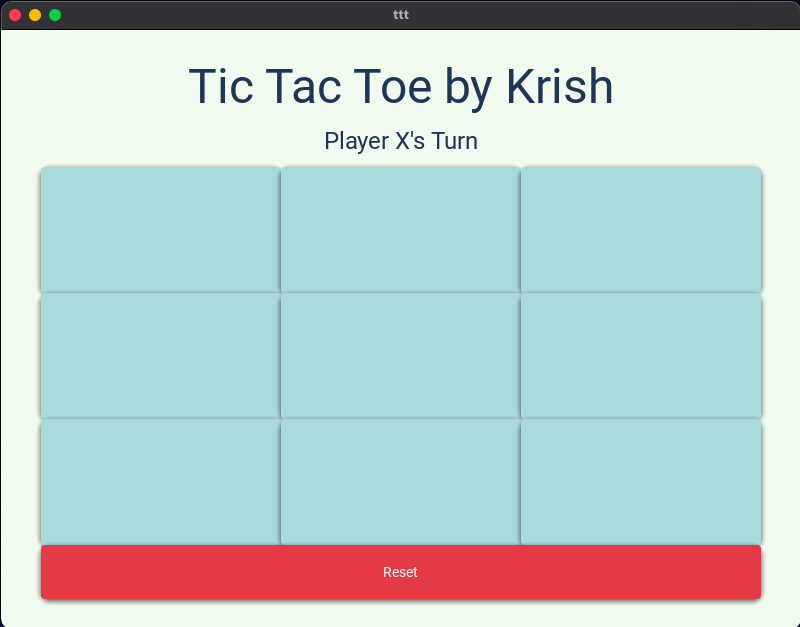
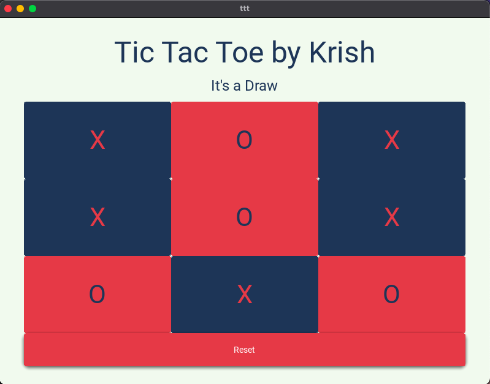
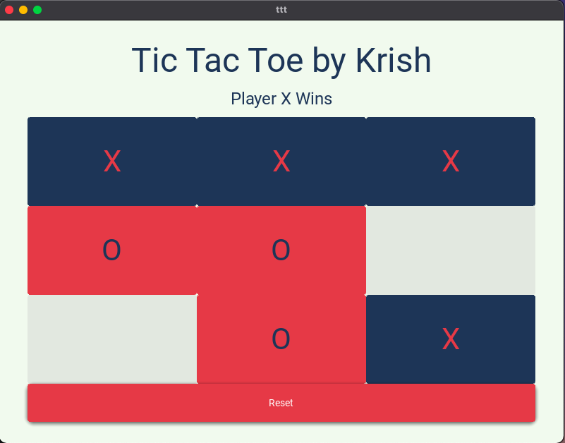

# Quiz 41: 

In this quiz we had to make a GUI for a Tic Tac Toe game.

# Link to the python file: (remember to scroll)

https://github.com/krishank-gupta/ib_com_sci/blob/5987034e704fc26e0c898ef08f52a0fec0604425/unit%203/quizzes/quiz041/main.py#L1-L75

# Link to the kivy file: (remember to scroll)

https://github.com/krishank-gupta/ib_com_sci/blob/5987034e704fc26e0c898ef08f52a0fec0604425/unit%203/quizzes/quiz041/ttt.kv#L1-L113

# Results GUI

# Results Draw

# Results Win

