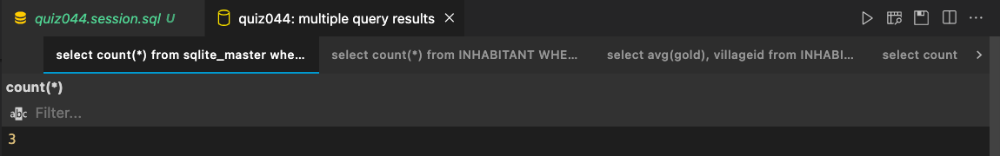
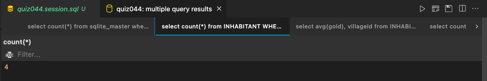
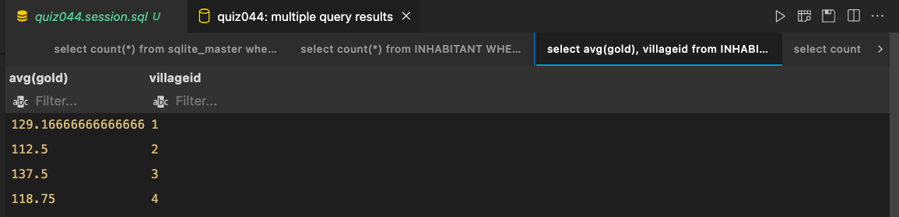
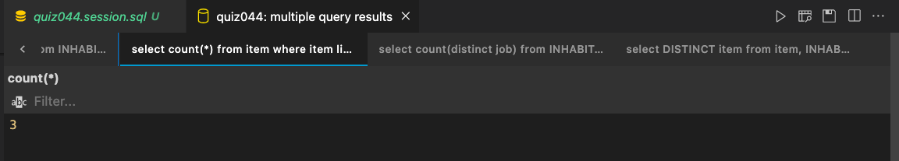
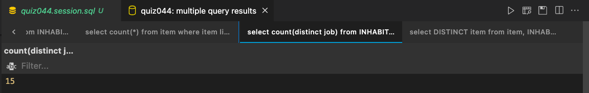
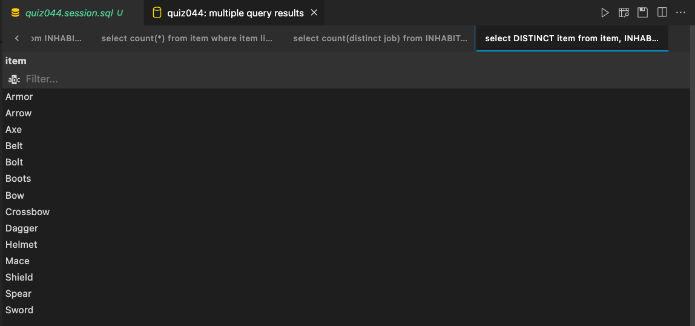

# Quiz 44: 

In this quiz we had to solve some simple questions using sql and provided database.

# Link to the SQL file: (remember to scroll)

https://github.com/krishank-gupta/ib_com_sci/blob/716854007229602ee058bd672c24c535a5260dd0/unit%203/quizzes/quiz044/quiz044.session.sql#L1-L11

# Results 

How many tables are there in the database?

How many Male inhabitants are Friendly?

What is the average gold by village?

How many items are there that start with the letter “A”

How many different jobs are there? 

What are the items owned by the herbalists?

