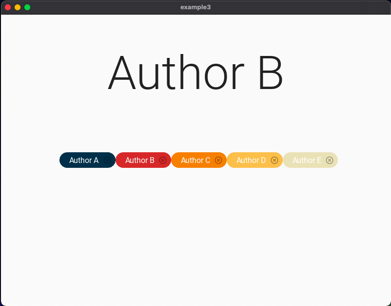

# Example 3: Chips

# Link to the python code: (remember to scroll)

https://github.com/krishank-gupta/ib_com_sci/blob/8d5b43898db282b078b605c791091b94d1ff8665/unit%203/tasks/gui_task/example3/example3.py#L1-L13

# Link to the python code: (remember to scroll)

https://github.com/krishank-gupta/ib_com_sci/blob/8d5b43898db282b078b605c791091b94d1ff8665/unit%203/tasks/gui_task/example3/example3.kv#L1-L36

# Results

 

