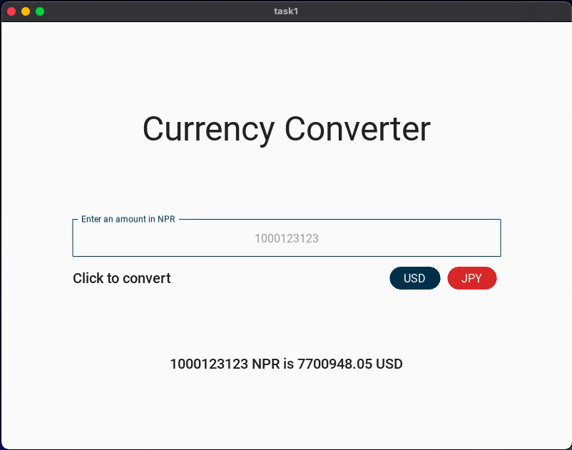
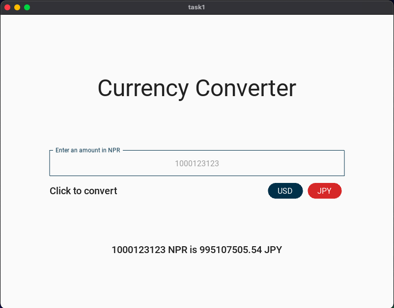

# Task 1: Currency Conversion with KivyMD 

This task was really fun to do.

# Link to the python code: (remember to scroll)

https://github.com/krishank-gupta/ib_com_sci/blob/a8521fb4da3d7f0572245f6a1b8fac79055c9eca/unit%203/tasks/gui_task/task1/main.py#L1-L26

# Link to the KiviMD code: (remember to scroll)

https://github.com/krishank-gupta/ib_com_sci/blob/a8521fb4da3d7f0572245f6a1b8fac79055c9eca/unit%203/tasks/gui_task/task1/task1.kv#L1-L48

# Results

### USD:

### JPY

 

