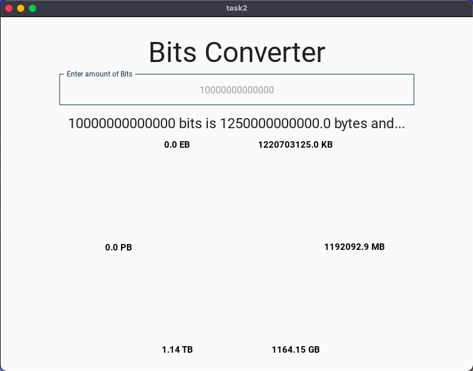

# Task 1: Currency Conversion with KivyMD 

I explored KiviMD Circular Layout in this task.

# Link to the python code: (remember to scroll)

https://github.com/krishank-gupta/ib_com_sci/blob/566c5011de3b65d8a8d8e0dd0450cf8bbd80ca6b/unit%203/tasks/gui_task/task2/main.py#L1-L43

# Link to the KiviMD code: (remember to scroll)

https://github.com/krishank-gupta/ib_com_sci/blob/566c5011de3b65d8a8d8e0dd0450cf8bbd80ca6b/unit%203/tasks/gui_task/task2/task2.kv#L1-L39

# Results

 

