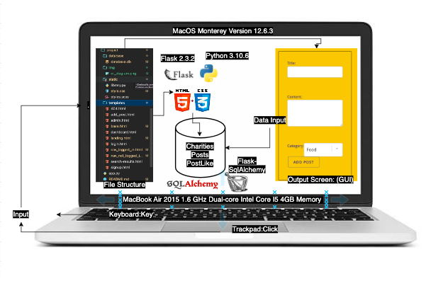
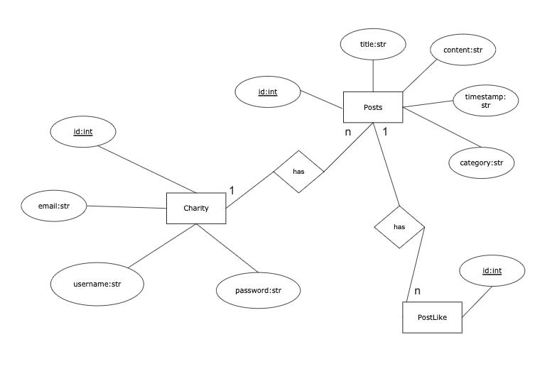
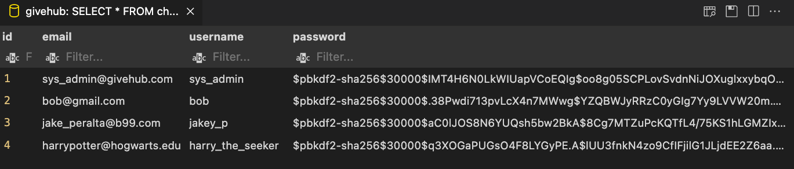
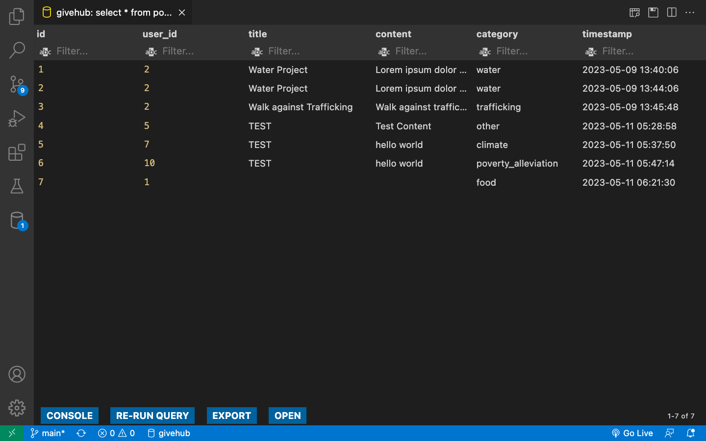
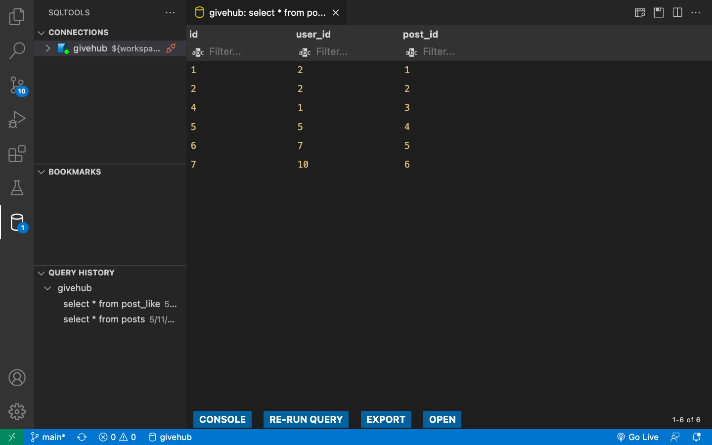
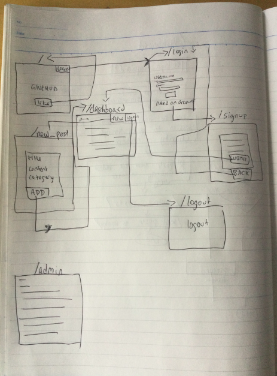
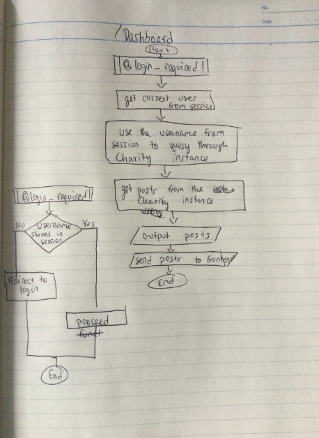
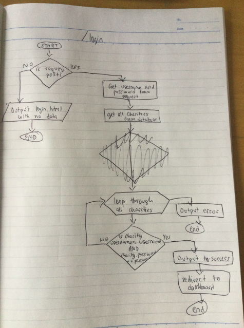

# Unit 4: A Unique Social Network (GiveHub)

## Table of Content

1. [Criteria A](#criteria-a)
2. [Criteria B](#criteria-b)
3. [Criteria C](#criteria-c)
4. [Criteria D](#criteria-d)
5. [Citations](#citation)
6. [Appendix](#appendix)

# Criteria A

## Problem Definition

I am a high school student at an International Baccalaureate School and for my Creativity, Activity, and Service project, I am working on improving education in Nepal. I need more funds to invest in my project and have to find alternate sources of funding. I have a limited reach and do not have any means to connect to people beyond my family, friends, and school. I have tried traditional fundraising methods but they have been time-consuming and have proven to be ineffective in securing enough funds. When talking to a friend working on a similar innovative idea, they told me that they couldn't find potential donors and had no way of knowing how many people are interested in their project (See appendix #1 for summary). Furthermore, there is no way of knowing how many projects/NGOs are in a community and how they are doing that does not violate the privacy of these projects/NGOs.  

I have tried to secure funds by reaching out to family and friends, selling drinks at markets, selling items in garage sales, etc, but these efforts have not been effective in securing enough funds. This method is very time consuming and has a limited reach, which means I am not able to connect with potential donors beyond my immediate network. Additionally, this method does not provide a convenient way for donors to find projects/NGOs that interest them and donate, which discourages them from contributing to the different projects/NGOs.

[See Appendix #1 for conversation with friend](#conversation-with-friend-12042023--1823jpt)

[See appendix #2 for feedback from advisor on problem definition](#meeting-with-advisor-1-20042023--1433jpt)

## Proposed Solution and Justification

My proposed solution is to create an online crowdfunding platform to connect potential donors with projects/NGOs they might be interested in donating to. My suggestion is to use Flask with Jinja and Flask-SQL_alchemy to create this crowdfunding website. 

I think Flask is a great choice as it is a lightweight and flexible Python web framework that is well-suited for developing simple web applications. Flask makes it easy to create applications tailored to specific needs and requirements, without the added overhead and complexity of larger frameworks like React. In contrast to WordPress, Flask offers more control and customization options for web development, including custom database models, flexible routing, and dynamic templating with Jinja. Overall, Flask's simplicity, flexibility, and customization options make it a great choice for creating a small crowdfunding website.

I propose to use Flask instead of other common tools like React or WordPress
I propose to use Flask-SQL_Alchemy for Data Management as it is the Flask implementation of SQL_alchemy and makes it very easy to create tables, add data to the tables, and get information from the tables. According to the documentation, flask-SQL_Alchemy "simplifies using SQLAlchemy with Flask by setting up common objects and patterns for using those objects, such as a session tied to each web request, models, and engines." (See citation #8)

## Success Criteria

1. __Clear categorization__: The website should clearly categorize charities based on their respective fields, such as education, health, poverty alleviation, and animal welfare, to help users find charities that align with their interests.
2. __Search functionality__: The website should provide a search functionality that allows users to search for charities by name or project name, making it easier to find relevant charities.
3. __Device optimization__: The website should be optimized for all devices, ensuring that users can access and use the site on their smartphones, tablets, and laptops.
4. __Like button__: The website should offer a like button that lets users express their support for a charity and see the number of likes a charity has received.
5. __Charity metrics__: The website should provide charities with measurable metrics, such as the number of likes and number of projects listed, to help them track their performance and make informed decisions.
6. __Site metrics__: The website should provide measurable metrics to the admin regarding the number of charities listed, number of monthly visits, number of projects listed, number of likes in each project.

# Criteria B

## System Diagram


**Fig.2.1** shows the system diagram

## Entity Relationship Diagram


**Fig.2.2** shows the relationship among the data tables.

Visualization of the above ER Diagram:


**Fig.2.2.1** shows the Charity table and what data it stores

**Fig.2.2.2** shows the Posts table and what data it stores

**Fig.2.2.3** shows the PostLike table and what data it stores

## WireFrame Diagram


**Fig.2.3** shows the relationship among different routes in the application

## Flowcharts

### Flowchart 1


**Fig.2.4** represents the code for dashboard screen in flowchart

### Flowchart 2


**Fig.2.5** represents the code for login screen in flowchart

## Test Plan

|        **Test Cases**       |                          **Purpose**                         |                                             **Inputs**                                            |                                              **Outputs**                                              |
|:---------------------------:|:------------------------------------------------------------:|:-------------------------------------------------------------------------------------------------:|:-----------------------------------------------------------------------------------------------------:|
|         Login System        |      To ensure login credientials are verified correctly     |      invalid email during registration:   email: 123 username: bob password: @SecurePassword      |                              Verify that the error message is displayed.                              |
|         Login System        |      To ensure login credientials are verified correctly     | valid credentials during regitration: email: jacob@gmail.com username: jacob password: 123 |                  Verify that registration is successful and success message is shown                  |
|         Login System        |      To ensure login credientials are verified correctly     |            Login with incorrect credentials: username: jacob password: notsecurepassword            |                                        Verify that login fails                                        |
|         Login System        |      To ensure login credientials are verified correctly     |              Login with correct credentials: username: jacob password: 123              |                       Verify that login is successful and dashboard can be seen                       |
|  Initial Database Creation  |    To ensure successsful creation of the database tables     |                                                none                                               |                   Verify that tables Charity, Posts, and PostLike have been created                   |
|         Post System         |          To ensure the users can post and view posts         |       try to submit a new post with missing title content: "lorem ipsum" category: "others"       |           Verify that the post was not added to the database and error message was displayed          |
|         Post System         |          To ensure the users can post and view posts         |                      title: "TEST" content: "Test Content" category: "others"                     | Verify that the post was added to the database and is visible in the main page and the dashboard page |
|         Like System         |        To ensure the users can like each other's posts       |                      Click on the like button on the TEST post created above                      |  Verify that the like counter increased and a LikePost instance was created and added to the server.  |
|    Lougout Functionality    | To ensure users can logout and sign into a different account |                          Click on the logout button in the navigation bar                         |          Verify that the user is logged out and removed from the session object in the server         |
| Logged in Privilege Routes  |   To ensure non-logged in users can't view protected routes  |                       Go to all protected endpoints as a non-logged in user                       |                           Ensure the system redirects you to the login page                           |
|    Admin Privilege Routes   |    To ensure non-admin users can't view admin-only routes    |                                        Go to /admin as bob                                        |                                     Ensure the page is not visible                                    |

## Record of Tasks

| **Task No.** |                **Planned Action**                |                               **Planned Outcome**                              | **Time Estimate** | **Target Completion Date** | **Criterion** |
|:------------:|:------------------------------------------------:|:------------------------------------------------------------------------------:|:-----------------:|:--------------------------:|:-------------:|
|       1      |                Meeting with client               |                      Start collecting context for problem                      |       10 min      |        1 April 2023        |       A       |
|       2      |             Create problem defination            |                        Have the client's problem defined                       |       25 min      |        3 April 2023        |       A       |
|       3      |             Create success criterias             | Have the success criteria of the application that solved the client's problems |      1 hours      |        3 April 2023        |       A       |
|       4      |        Present success criteria to advisor       |       Have the success criteria of the application approved by the client      |     10 minutes    |        10 April 2023       |       A       |
|       5      |            Choose suitable CSS Library           |          Have a CSS library to make front end easy to develop and fast         |       1 hour      |       15th April 2023      |       A       |
|       6      |       Write rationale and proposed solution      |         Have the tools used in the application explained and justified         |     45 minutes    |       15th April 2023      |       A       |
|       7      |         Create and explain system diagram        |     Design and explain a system diagram to represent the application system    |     25 minutes    |       15th April 2023      |       B       |
|       8      |          Create Entity Relation Diagram          |              Create and explain relations between database tables              |     20 minutes    |       15th April 2023      |       B       |
|       9      |                Create UML Diagram                |       Create and explain the relation between different classes in python      |     40 minutes    |       15th April 2023      |       B       |
|      10      |      Start working on login system back-end      |          Have a working login system in place (Flask and SQL ALchemy)          |      1 hours      |       25th April 2023      |       C       |
|      11      |             Create WireFrame Diagram             |                 Show how the screens change in the application                 |     30 minutes    |       25th April 2023      |       B       |
|      12      |                   Create Routes                  |    Create all routes necessary in the application including protected routes   |     45 minutes    |       25th April 2023      |       C       |
|      13      |       Create login and register pages HTML       |                        Have the GUI for the login system                       |      2 hours      |       25th April 2023      |       C       |
|      14      |                 Design Test Plan                 |     Design an ellaborate plan for testing the application for possible bugs    |      2 hours      |       25th April 2023      |       B       |
|      15      |                 Create Home page                 |                          Create the landing page GUI                           |      1 hours      |       25th April 2023      |       C       |
|      16      |                Create Posts System               |       Have the user be able to add posts and view posts in dashboard page      |      2 hours      |         1 May 2023         |       C       |
|      17      |                Create Like System                |                      Have the users be able to like a post                     |       1 hour      |         1 May 2023         |       C       |
|      18      | Ensure application succeeds all success criteria |                      Have all success criterias fullfilled                     |       1 hour      |         5 May 2023         |       E       |
|      19      |              Ensure test plan passes             |                    Have all test cases pass to prevent bugs                    |       1 hour      |         5 May 2023         |       E       |
|      20      |            Create video for criteria D           |                     Have a video showcasing the application                    |       1 hour      |        10th Mar 2023       |       D       |
|      21      |              Finish record of tasks              |                        Have a completed record of tasks                        |       1 hour      |        10th Mar 2023       |       C       |
|      22      |              Choose the color theme              |     Experiment color themes and hues and find the best fit for a fridge app    |     20 minutes    |        10th Mar 2023       |       C       |
|      23      |                Complete citations                |                                Finish citations                                |       1 hour      |        10th Mar 2023       |       -       |
|      24      |                  Implimentation                  |                            Implement the Application                           |      30 mins      |         11 May 2023        |       C       |

# Criteria C

## Key Code with explanations:

### Protected Routes:

A problem that arose when trying to solve client requirements was that non-logged in user could view pages like the dashboard or new_post. The dashboard did not provide any sensitive data so it was not a big problem but the new_post was. The new_post page allows users to enter posts and the logged in user is automatically saved as the author. The non-logged in user being able to access this page and create posts raised a KeyError. To solve this, I implemented protected routes system that are described below:

```.py
def login_required(f):
    def wrapper(*args, **kwargs):
        if 'username' not in session:
            return redirect(url_for('login'))
        return f(*args, **kwargs)
    wrapper.__name__ = f.__name__
    return wrapper
```

The code above sets up a custom decorator @login_required and takes a nested function wrapper that checks if there is a username stored in the session object (which is saved during login using `session['username'] = username`). If there is not a user saved in the session, the code redirects the user to the login page using the url_for function imported from the flask. The function builds a redirect link by looking at functions present in each route in the flask app. If there is a user present in the session, the original function is called so the logged in user can view the page.

```.py
def admin_privilege_required(f):
	def wrapper(*args, **kwargs):
		# print(session['username'])
		if 'username' not in session or session['username'] != adminUsername:
			return redirect(url_for('index'))
		return f(*args, **kwargs)
	wrapper.__name__ = f.__name__
	return wrapper
```

Similar to the above decorator, the code above sets up another decorator @admin_privilege_required that checks if the username stored in the session matches the adminUsername. If not, the user is redirected to the landing page. 

### Dashboard Code:

```.py
@app.route('/dashboard')
@login_required
def show_user_profile():
	current_user = session.get('username')
	user = Charity.query.filter_by(username=current_user).first()
	posts = user.posts.all()
	return render_template('dashboard.html', data=posts)
```

The code above is used to create the /dashboard endpoint which uses the @login_required dashboard to protect it. The code then uses Object Relational Mapping with Flask-SQL_Alchemy to filter through the database using the current username and match all posts of the logged-in user. It is then saved in a post variable and sent to the frontend. The data is caught in the front end like this (code for dashboard.html): 

```
<title>Dashboard | GiveHub</title>





your posts:
    
    
    <section class="section-secondary">
        <div class="col col-md-6">
            <div class="card">
                <h3 class="card-title">{{ post['title'] }}</h3>
                <h6 class="card-title">by {{ post['user_id'] }}, on {{ post['timestamp'] }}. tags: {{ post['category'] }}</h6>
                {{ post['content'] }}                
                <h3 class="card-title">{{ post.get_like_count() }}</h3>
            </div>
        </div>
    </section>
    

 

```

Jinja is used to see if there is a data variable being recieved from the server. If there is, jinja loops through every element in the data variable and presents the data in a card. Initially, I was using indexes to show the data like
`<h3 class="card-title">{{ post[0] }}</h3>` however, this caused an error because not all posts had the same amount of data. Additionally, it also caused errors when I changed the positioning of the data in the server. 

### Search Feature

```.py
@app.route('/search')
def search():
	data = []
	query = request.args.get('query')
	posts = Posts.query.filter(or_(Posts.title.contains(query), Posts.content.contains(query))).all()
	for p in posts:
		data.append((p.id, p.author.username, p.title, p.content, p.category, p.timestamp, p.get_like_count()))
	return render_template('search-results.html', data=data)
```

The above code is used to implement a search feature in the application. It creates a /search endpoint which accepts a parameter query. The search keyword is accessed from the parameter using `reuest.args.get('')` and saved in the server. Then, the posts table is filtered through titles and content of the post using or_ which creates an 'or' gate. The posts that were found are saved in the posts vairable and looped through. The data inside each found post is saved in the data list and then sent to the front end.

A problem I faced during the search feature implementation was that the posts only filtered through the title or the content. A post with the search keyword in the title was not being displayed when filtered through the content. To solve this, I had to conduct a lot of research because I did not know there was a or_ function that could allow me to do this. Upon research, I found the or_ function (See Citation #9)

## List of Techniques Used

### Mustard UI

Mustard UI is no JavaScript, CSS Framework that helped in creating designs in the web app as well as making it responsive.

### Jinja

Jinja is a popular templating engine for Python web frameworks, including Flask. It is used to generate dynamic HTML pages or other markup languages. Jinja is designed to be easy to read and understand, and it has a syntax that is similar to Python. Jinja allowed me to define templates that can be reused across multiple pages. 

### Object Relational Mapping using SQL Alchemy

#### Creating tables

```.py
from flask_sqlalchemy import SQLAlchemy
from sqlalchemy import DateTime, or_
from sqlalchemy.sql import func

db = SQLAlchemy()
app = Flask(__name__)

app.config['SQLALCHEMY_DATABASE_URI'] = 'sqlite:///' + os.path.join(
    app.root_path, 'database', 'database.db')# initialize the app with the extension

db.init_app(app)

class Charity(db.Model):
	id = db.Column(db.Integer, primary_key=True)
	email = db.Column(db.String, unique=True, nullable=False)
	username = db.Column(db.String, unique=True, nullable=False)
	password = db.Column(db.String, unique=False, nullable=False)
	posts = db.relationship('Posts', backref='author', lazy='dynamic')

	def like_post(self, post):
		if not self.has_liked_post(post):
			like = PostLike(user_id=self.id, post_id=post.id)
			db.session.add(like)
			db.session.commit()
		else:
			PostLike.query.filter_by(
				user_id=self.id,
				post_id=post.id).delete()
			db.session.commit()


	def has_liked_post(self, post):
		return PostLike.query.filter(
			PostLike.user_id == self.id,
			PostLike.post_id == post.id).count() > 0

class Posts(db.Model):
	id = db.Column(db.Integer, primary_key = True)
	user_id = db.Column(db.Integer, db.ForeignKey('charity.id'))
	title = db.Column(db.String(1000), nullable=False) # Added this line
	content = db.Column(db.String(1000), nullable=False)
	category = db.Column(db.String(1000), nullable=False)
	timestamp = db.Column(DateTime(timezone=True), default=func.now())
	likes = db.relationship('PostLike', backref='post', lazy='dynamic')

	def get_like_count(self):
		return self.likes.count()

class PostLike(db.Model):
	__tablename__ = 'post_like'
	id = db.Column(db.Integer, primary_key=True)
	user_id = db.Column(db.Integer, db.ForeignKey('charity.id'), nullable=False)
	post_id = db.Column(db.Integer, db.ForeignKey('posts.id'), nullable=False)

```

The above code is used to create tables, Charity, Posts, PostLike using Flask-SQLAlchemy. The Charity table represents a charity organization and has id, email, password, username, and posts (a 1 to n relationship with the posts table). Additionally, The like_post method is defined within the Charity model, which takes a post object as a parameter. It checks if the Charity object has already liked the post object or not, and adds a new PostLike object with the corresponding Charity and Post IDs if not liked yet. If already liked, then the PostLike object is deleted.

The Posts table represents a post created by a charity organization and has the following columns: id, user_id, title, content, category, timestamp, likes (a 1 to n relationship with PostLike model). The get_like_count method is defined within the Posts model, which returns the number of likes for a given post.

The PostLike model that is used to track likes and consists of an id, user_id, and post_id.

#### Adding data to tables

```.py
signup_email = request.form['signup_email']
signup_username = request.form['signup_username']
signup_password = hash_password(request.form['signup_password'])
new_charity = Charity(email=signup_email, username=signup_username, password=signup_password)
db.session.add(new_charity)
db.session.commit()
```

The code above is used to create a new user (charity). The first three lines is used to get the information from a post request from the front-end registration form. Then, the information is used to create a new instance of the Charity model which is then added into the database (db) and saved.

#### Retrieving data from tables

```.py
	user = Charity.query.filter_by(username=current_user).first()
```

This code is used to get the instance of the logged-in user using the current_user variable stored in the session object. The query is filtered by usernames in the table until the current_user's username matches and is returned and saved in the user variable. 

```.py
	post = Posts.query.filter_by(id=post_id).first_or_404()
```
This code is used to get the post instance by using the post id. It allows a 404 method that takes the front end to a 404 page if no posts with the provided id was found.

### Coding Principles/Paradigms

#### DRY: Don't Repeat Yourself

There are several places where this principle is used to simplify the code and simplify the life of the programmer. A few example of these are listed below:

Using base.html: a base.html file was used to avoid repeating the same code present in every html file. All other html files extend this base file. This makes possible changes as well as debugging very easy.

Using templates for navigation bar: similar to base.html, navigation bars for logged in user and non-logged in user is saved in a template file and added to every other html page using ``

#### KISS: Keep it Simple, Stupid

The entirety of the code follows the KISS paradigm

Minimalism: The code only includes the necessary statements to accomplish the task. There are no unnecessary lines of code or complex logic.

Readability: The variable names are simple and self-explanatory. The code is easy to read and understand, even for someone who is not familiar with the programming language. Comments are present when a code might not be self-explanatory.

Avoiding unnecessary complexity: The code does not include any advanced data structures or algorithms. It simply iterates over the array and checks if each value is greater than the current maximum.

### Git and GitHub

Git is used as version control in the development of this application. After every major milestone, a git commit is made to keep track of the updates. If there are any problems in the code, the code can be reverted to a previous git commit. This insures that the application is unaffected by any bugs that may arise when the code is changed or when more additional code is added. Additionally, the code is uploaded to GitHub after every commit to insure that the code is in the cloud and any physical liabilities to the developer's laptop doesn't affect the development of the application. GitHub Command Line Interface is used to make this process efficient.

## Computational Thinking

Algorithmic Thinking: In the creation of the tables. There are 3 functions, like_post, has_liked_post, get_like_count. These are prime examples of algorithmic thinking because it involves a set of instructions to perform specific tasks. Each function has a specific purpose, and they are called in a specific order to achieve the desired results. The code uses if-else statements to check if certain conditions are met, loops to iterate over data, and functions to perform various operations.

Abstraction and Decomposition: The code uses many libraries, imports, classes, and functions to break down code in chunks and simplify the program's structure. An exmaple of this is the use of templates in the front-end using jinja. Another example is the use of a library that stores functions that are repeated throughout the application.

Modularization: The code is modular as it is divided into multiple modules or files. It uses Flask and SQLAlchemy libraries to handle routing and database interactions, respectively. The database schema is also defined in a separate module. Additionally, functions like login_required and admin_privilege_required can be reused across different routes to enforce authentication and authorization.

Data Representation: The code represents data using different data types like Strings, Integers, and Booleans to capture and manipulate the data's state. 

Logical Reasoning: The code includes conditional statements and logical operators not only in flask but also with data management to make decisions based on certain conditions. 

# Criteria D

[](https://youtu.be/E8fkRtrR2J0)
**Fig.4.1** the video developed for an introduction of how the application works, success criteria, and test plan.

# Citation

1. ChatGPT, (2023), with prompt "Create a login system in flask without using flask-login"

2. ChatGPT, (2023), with prompt "In flask when querying using filters, how to show 404 when none are found"

3. ChatGPT, (2023), with prompt "How to use session object for storing logged in user"

4. ChatGPT, (2023), with prompt "Best way to implement a like feature in a flask app"

5. Stack Overflow. "Search function query in Flask SQLAlchemy". 2017. Accessed 11 May 2023. https://stackoverflow.com/questions/42579400/search-function-query-in-flask-sqlalchemy.

6. Stack Overflow. "How do I implement a like button function to posts in Python Flask?". 2018. Accessed 11 May 2023. https://stackoverflow.com/questions/52665707/how-do-i-implement-a-like-button-function-to-posts-in-python-flask.

7. Logue, Kyle. "Mustard UI - A CSS Framework". 2023. Accessed 11 May 2023. https://kylelogue.github.io/mustard-ui/index.html.

8. Flask-SQLAlchemy. "Documentation - Flask-SQLAlchemy". 2023. Accessed 11 May 2023. https://flask-sqlalchemy.palletsprojects.com/en/3.0.x/.

9. Stack Overflow. "In Flask, how to retrieve the current user's ID from the database?". 2011. Accessed 21 Apr 2023. https://stackoverflow.com/a/7942571.

# Appendix

## 1 Conversation with friend (12/04/2023 @ 18:23JPT)

Purpose: to get information about their project
Outcome: found out they have trouble finding donors

## 2 Meeting with advisor #1 (20/04/2023 @ 14:33JPT)

Purpose: Get problem defintion approved  
Outcome: Problem definition was approved

## 3 Meeting with advisor #2 (9/5/2023 @ 9:33 JPT)
Purpose: To present MVP and get feedback
Outcome: MVP was liked. Suggested to make two different user types one for charity and one for donor.

